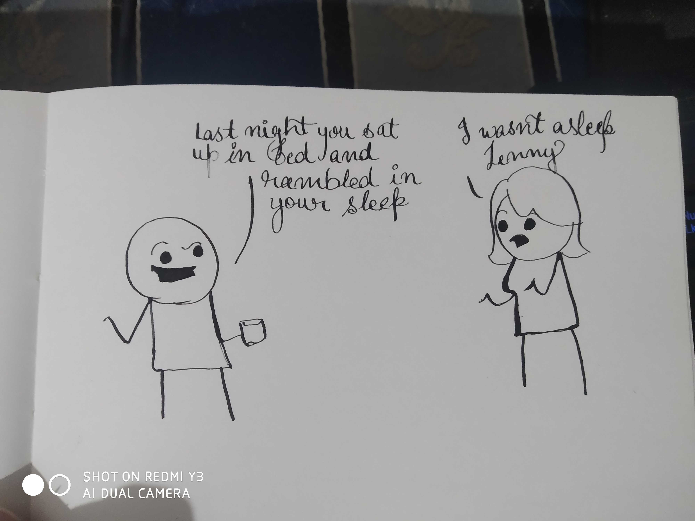
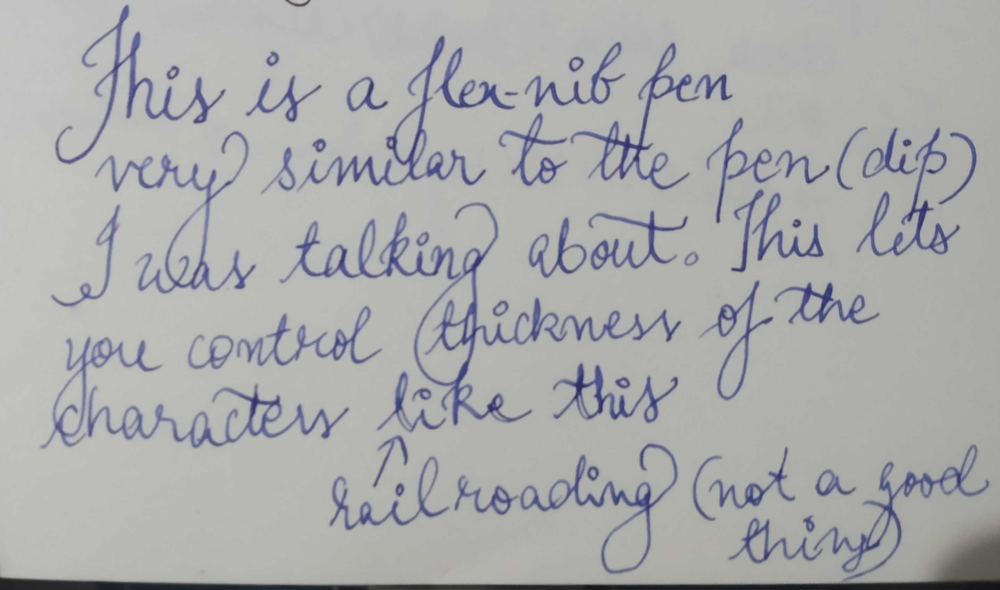

This year around February mid, I was introduced to [mountainofink.com](https://www.mountainofink.com/). The blog itself is aesthetically pleasing and my friend happened to show me a collection of inks with passion I barely understood, but it stirred out a memory that I didn't think I'll revisit. You may remember it as a _satisfying_ gif on popular social media.

<iframe width="560" height="315" src="https://www.youtube.com/embed/ihbsJMjIFD0" frameborder="0" allow="accelerometer; autoplay; encrypted-media; gyroscope; picture-in-picture" allowfullscreen></iframe>

I remember watching this longer than I'd like to admit, something about the symmetry, the flow, the flexing tines of the nib. Having met an old memory again, I felt an inspiration for calligraphy.

## Supplies
1. Brause Steno Nib.
2. Pilot Iroshizuku - Take Sumi. (Standard dark ink, works with dip and fountain pens)
3. Artangle The Almond Branches By Vincent Van Gogh Hardcover Plain A5 Size Premium Notebook (190 gsm sheets)
4. KABEER ART Dip Pen Oblique Calligraphy Pen Holder Set Of 1 (Nib Holder)

## Fooling around
I like the humour in cyanide and happiness comics. Here is an attempt at drawing the following comic. The tines of this pen
are hard to control. Although nothing that practice can't solve, I wish I had a platform to post hobby work to keep me closer 
to the early struggles and improvements of future.

An attempt at a single frame needing basic shapes and I run out of fingers trying to count irregularities. It is fun to notice
how arcs and lines as simplified in both the drawings convey emotion. The original seems casual about the episode. While my attempt
appears to carry a different mood. A taunt. Should be useful to use eyebrows this way when I need that look.

 

Alphabets are easier, I practiced for an hour daily for a few days. I still can't control the pressure during the down-strokes
and stay gentle during the up-strokes which yield really pleasing effects.

