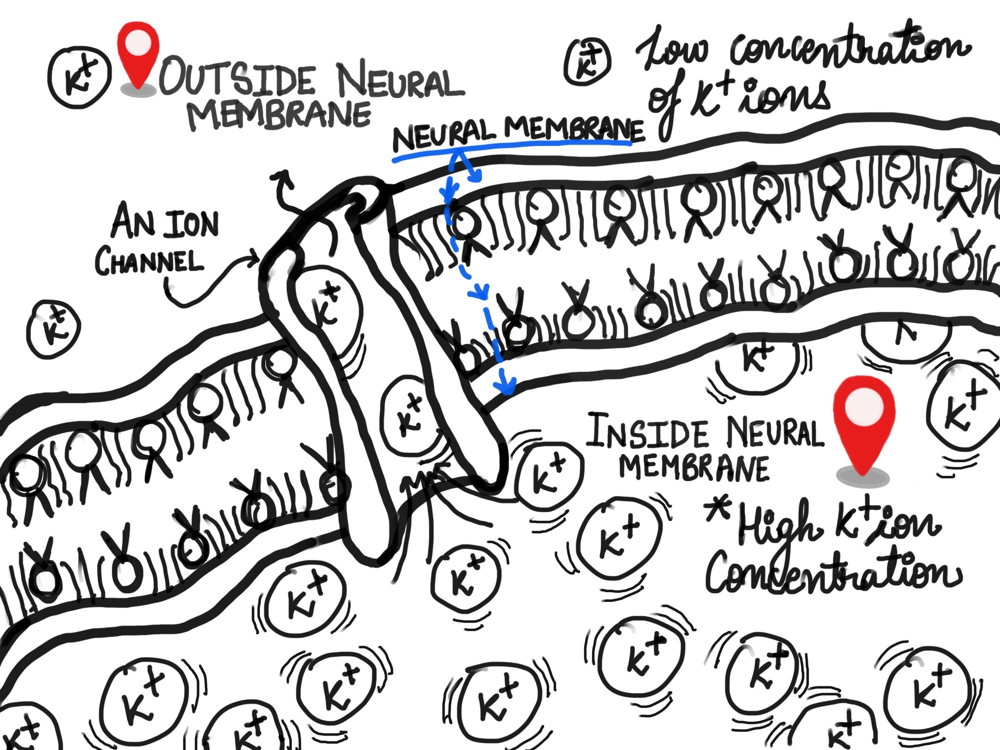
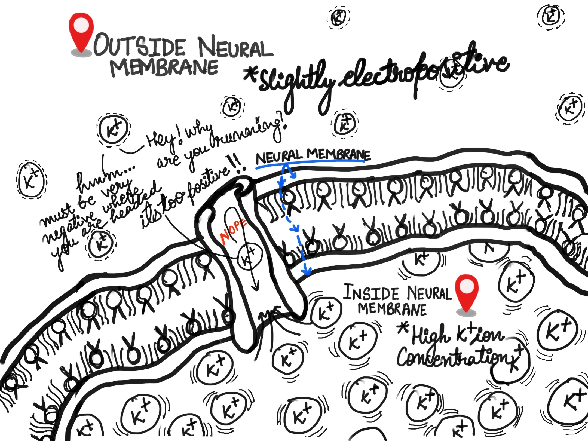

Communication across neurons happens by the means of electric-signals. The electricity is due to the presence of $Na^{+}$, $K^{+}$, $Ca^{2+}$ and $Cl^{-}$ ions. These _charges_ are present around the neurons, separated by a neuron's membrane. This separation creates a _potential difference_. If a neuron is at rest this _potential difference_ is then called the _resting potential_.

### Facts
1. Charges that cause neural activity: $Na^{+}$, $K^{+}$, $Ca^{2+}$ and $Cl^{-}$ ions.
2. The _potential difference_ of a neuron at rest is called _resting potential_.
3. _Membrane potential_ is the voltage across the membrane of a neuron. (values lie between $-90\text{mV}$ $+60\text{mV}$).
4. _Resting potential_ is the _membrane potential_ of a neuron at rest. The values are about $-70\text{mV}$.

If the outside of a neuron at rest is $50\text{mV}$ more positive than it's inside, then the _membrane potential_ is $-50{mV}$.

## Ionic movement
So far we have established that neurons have electric charges due to the presence of some ions. We also went through membrane potential and some values that they may have. Let's try to visualize how the charges are acquired.

### Diffusion
Imagine a liquid in a container. Adding a drop of colour will cause the colour to disperse farther from the point of initial contact in a random fashion. Diffusion defines movement from a region of high concentration to lower concentration. This means at some point the concentration throughout the liquid will be similar at that point the movement would cease.

### Electrostatic forces
Charges can be positive or negative depending on the presence of electrons in the material. If same type of charges are brought together, they will repel each other. Charged materials seek the opposite type of charge to balance their excess or deficit of charge so that they can go back to their non-ionized, natural state.

## Building charges
Let's assume a scenario, if the concentration of say, $K^{+}$ ions inside the neuron is $200 mM$ while outside the concentration is $10mM$, then diffusion will cause $K^{+}$ ions to move outside. This follows a more positive charge on the outside of the neuron's membrane. The movement is facilitated by ion channels, these ion channels have limited permeability which is different for different ions. 

As the positive charge grows, it becomes harder for other ions to move out. (Refer to the comic in [Electrostatic Forces](#electrostatic-forces)), you can now imagine the two forces taking part in a tug of war. In terms of statistics, only 1 in 100,000 $K^{+}$ ions need to move out to reach equilibrium of these forces. This shows how much dominant is the electrostatic force over the force of diffusion.

It is worth taking a note that the volume of ions on either side of the membrane don't drive the electrical potential of the neuron. The important bit is the concentration gradient. We can understand more from the **Nernst Equation**. **Nernst Equation** describes the electric potential, given the concentration of ions around the membrane. 

## Nenst Equation
$$
E = \frac{RT}{zF}\ln{\frac{\text{ion } \text{concentration } \text{outside }}{\text{ion } \text{concentration } \text{inside}}}
$$
