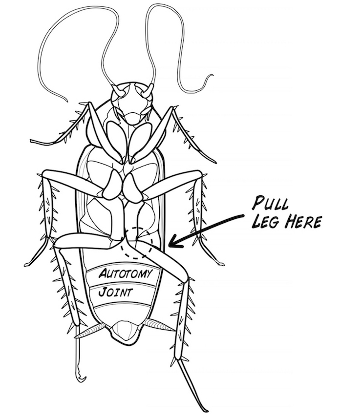
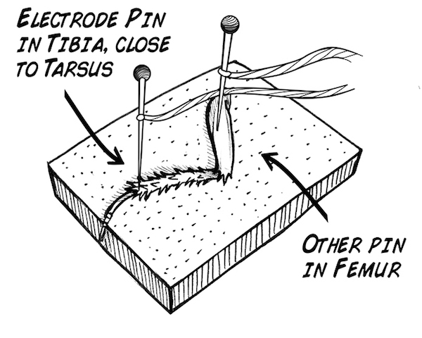
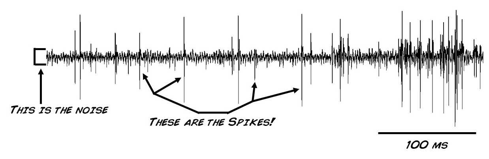
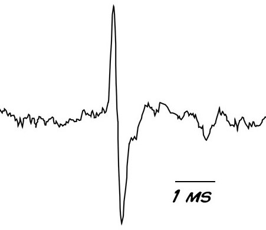

I am going through a course on [edx.org](https://courses.edx.org) named: [Fundamentals of Neuroscience, Part 1: The Electrical Properties of the Neuron](https://courses.edx.org/courses/course-v1:HarvardX+MCB80.1x+3T2019/course/). Binge watching lecture series are not as effective as watching movie-series. To that extent I couldn't enjoy movie series at a stretch anyway. Interest alone can only take one so far. So I decided to take a break and watch a few *treats* hidden for the later parts of the course.

I remember visiting [backyardbrains](https://backyardbrains.com/) looking for neuroscience experiments and found a bunch of tools, blogs, experiments that I wish I had found before. I see a video lecture from the same team that makes [these things](https://backyardbrains.com/products/).

This video session contained the following:

1. Getting a Cockroach unconscious.
2. Obtaining artifacts.
3. Rate coding the neural activity.
4. Getting the leg to move.

## Prepare the subject
Cockroaches are cold blooded animals. So from the Nernst Equation:

$$
E = \frac{RT}{zF}\ln{\frac{\text{ion } \text{concentration } \text{outside }}{\text{ion } \text{concentration } \text{inside}}}
$$

We can tell that as the temperature falls, the electric field due to any ions will cease to exist. This is all that's needed to put the cockroach unconscious, a bucket full of ice-water.

## Obtaining artifacts

Once you have an unconscious cockroach, you umm... are required to do the thing.

## Rate coding neural activity
Place the leg on cork surface and pin two electrodes in, as shown in the image:

We need a device to amplify the potential difference so that it can be seen while isolating noise. Touching the hairs of the leg causes neurons to spike and create a response that can be seen in the following image:

Zooming into a section shows the action potential of a neuron. The reason behind this behaviour is stated to be the opening and closing of $Na^{+}$, ${K}^{+}$ ion-channels.

## Getting the leg to move
So far, we read the information that was going across the limb, reading the neural signals. Is it possible to send signals back? and what does that do?

The course shares that a song with high _bass_ component is a good fit because of the lower frequency in the audio that gets encoded as electricity would cause the leg to twitch. The twitching is inversely proportional to the frequency and directly proportional to the volume. Here's the video from backyardbrains.

<iframe width="560" height="315" src="https://www.youtube.com/embed/edEXKiOmPvE?start=720" frameborder="0" allow="accelerometer; autoplay; encrypted-media; gyroscope; picture-in-picture" allowfullscreen></iframe>

_fin_.
