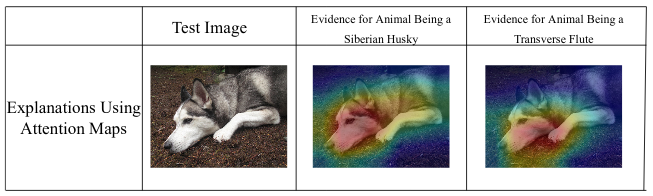

```markdown
@misc{rudin2018stop,
    title={Stop Explaining Black Box Machine Learning Models for High Stakes Decisions and Use Interpretable Models Instead},
    author={Cynthia Rudin},
    year={2018},
    eprint={1811.10154},
    archivePrefix={arXiv},
    primaryClass={stat.ML}
}
```
Key points:

1. Explainable models.
2. Interpretable models.


## Interpretable Models
- Constraints lie within the model.
- Obeys structural knowledge of the domain.
- Case based reasoning for edge-cases?


## Issues with explainable ML

### Blackbox
- Complicated for humans to understand.
- Enveloped around proprietary logic.

### Trade-off between accuracy and interpretability.
- If there is structure in data, with good representation of features. The difference in performance
of complex classifiers (neural networks) against simpler classifiers (Logistic regression) is not high.

### Explainable methods provide explanations that are not faithful to predictions of the model.

> If the explanation was completely faithful to what the original model computes, the explanation would equal the original model, and one would not need the original model in the first place ...

#### ProPublica analysis
Accused COMPAS to be racially discriminative because the predictions match a model that uses racial information for parole and bail decisions. COMPAS, was conditioned on age and criminal history. The similarity in the behaviour shouldn't have been used as explanation.

The authors claim that instead of using the term `explanation` if these are instead called `trends`, `summary statistcs` etc would be less misleading.

### Explanations may not make sense, or provide details.



We have no idea why this image is labeled as either a dog or a musical instrument when considering only saliency. The explanations look essentially the same for both classes

> Poor explanations make it hard to troubleshoot a black box.

### Black box models are not compatible with situations where information outside the database is required for risk-assessment.

The example case is from criminalogy, where circumstances of the crime are much worse than a generic assigned charge. This knowledge could increase or decrease `risk`. Black box models are hard to caliberate with such information. COMPAS model doesn't depend on the seriousness of the current crime.

### Black box models with explanations can lead to complicated decisions.
Typographical errors.


## Key issues with Interpretable ML

### Corporations make profit from the intellectual property.
### Interpretable models can entail significant effort to construct.
- Compute
- Domain expertise
