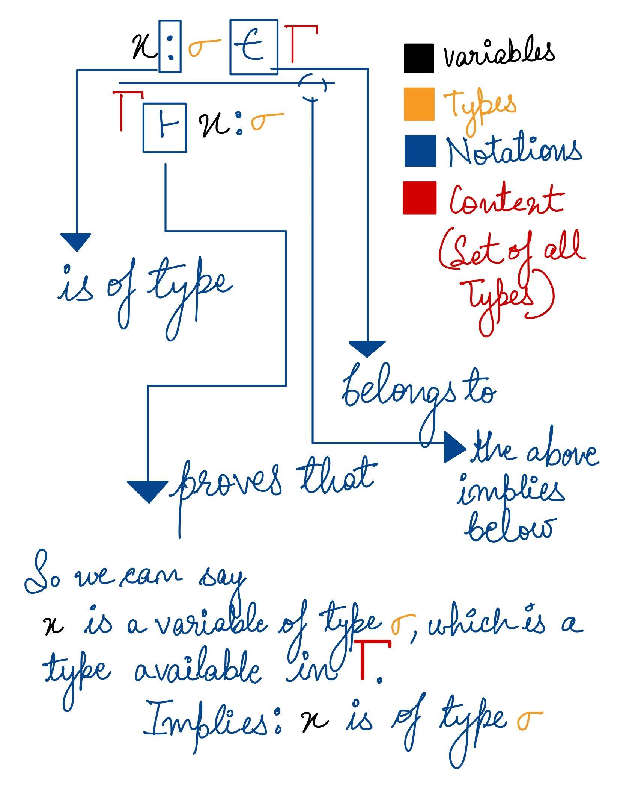
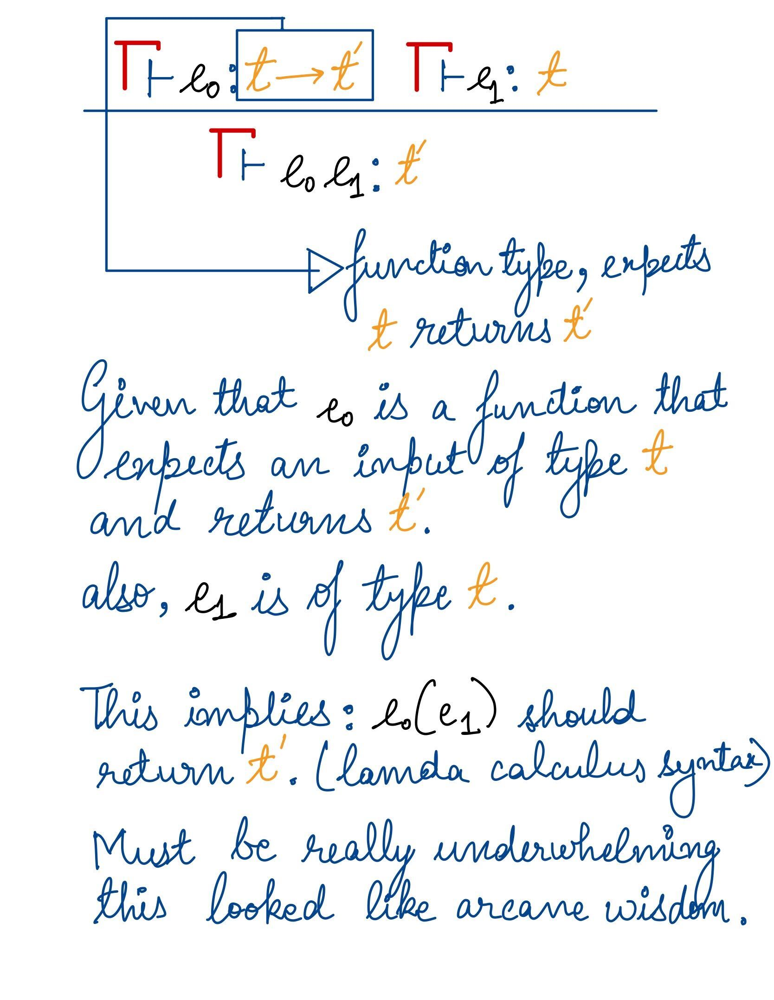
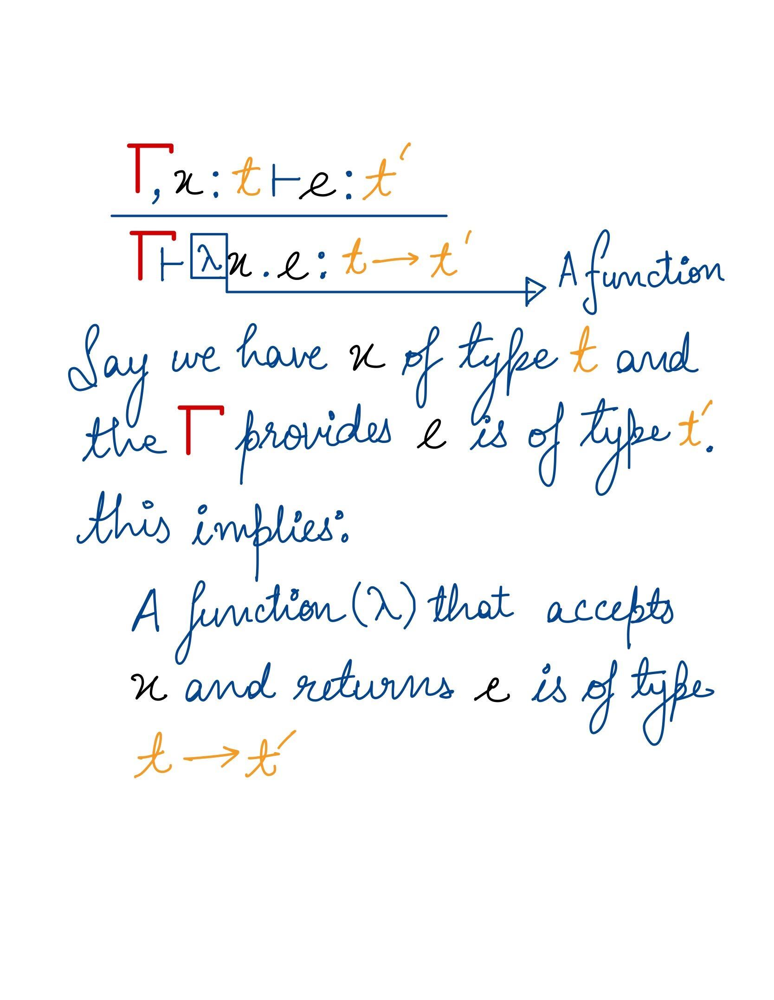
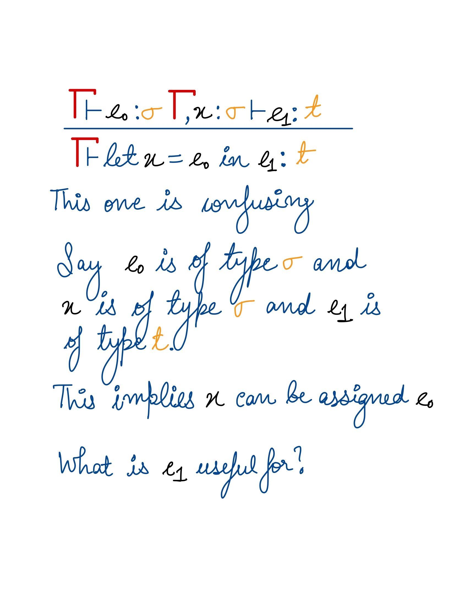
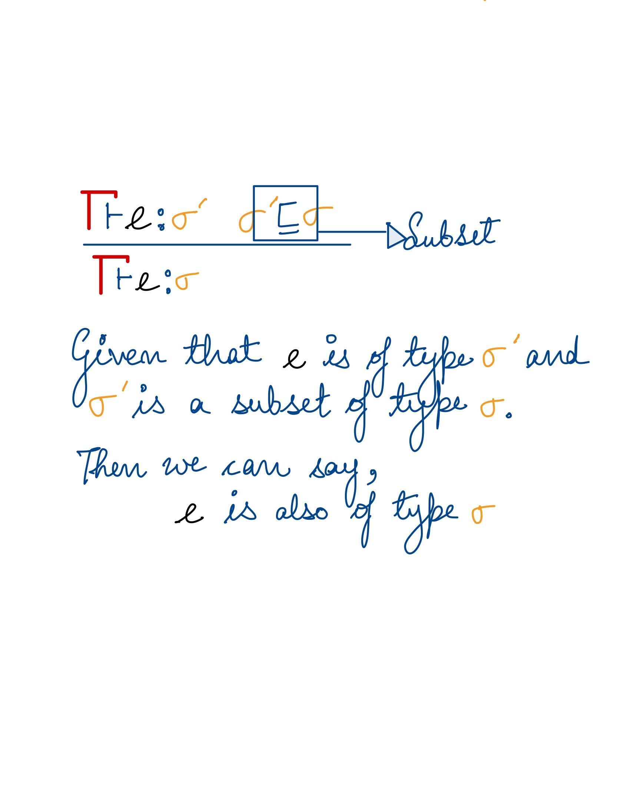
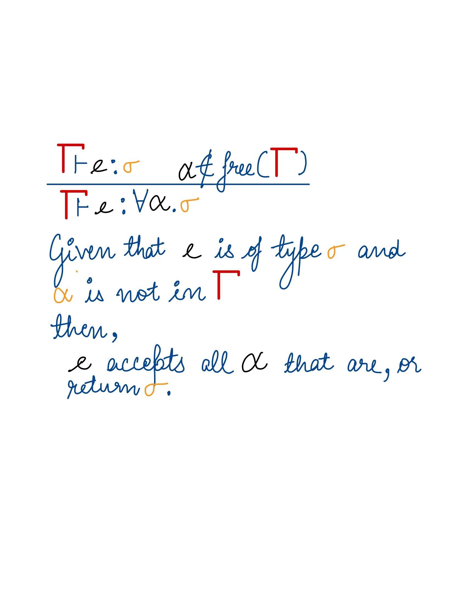

A friend introduced me to Hindley Milner set of equations and
the first time (Oct 2019), they looked like arcane maths problems. The looked no different the 7th or 8th time I saw them. I felt the notations were heavily throwing me off. In 2020 I revisited type systems and saw the same equations again. 

Luckily this time, I found this [stackoverflow](https://stackoverflow.com/questions/12532552/what-part-of-hindley-milner-do-you-not-understand) thread that resonates with my helplessness of the terminology used. After going through the thread and understanding missing pieces from other sources, here is my take on the equations.

I didn't fully understand this, why is $e_1$ required, it doesn't seem to help proving anything?
Let me know in the comments, clearly I am missing something.

