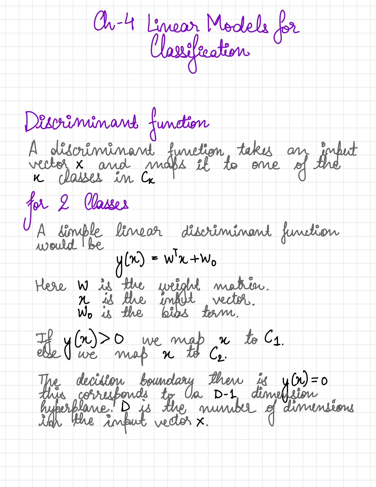
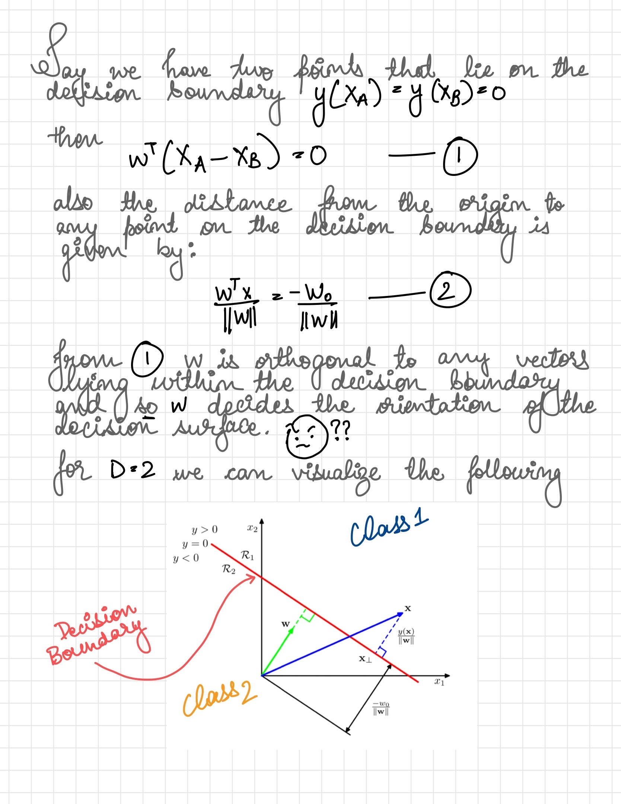

I covered my plans around a study break in a [previous post](https://ltbringer.github.io/blog/study-breaks), concluded on 1st Jan 2021.

My experience was highly positive, a quick set of points on: :

## Things that worked

1. Spending time on machine learning theory is a good investment; having a preference for directly usable knowledge initially made me shy away from research-papers and books. I found topics of relevance which otherwise, would only be addressed via intuition.
2. I have a list of topics that are of interest and relevance. Usually, I would pick a dense topic that takes time to comprehend but the lack of relevance makes it very hard to follow regularly.
3. Near the final few days, I was able to study for 2 hours. My concentration levels are embarrassing but being able to sit and study made me feel I am not a lost cause.
4. Not to flex, but I managed to understand Bayes theorem and can derive it. The assumptions are not understood well but its a long way from mugging up the formula.

## Things that didn't

1. I focused on ML, I had prgoramming and ml checkpoints planned. Didn't work out.
2. Need to study atleast 2-3 hours everyday to improve comprehension. I found it very difficult to keep myself from wandering off due to fatigue or excitement.
3. Couldn't stick to a self-made syllabus. There were days where I couldn't keep myself away from work commitments. Add this to a squirrel's attention-span, and you get nothing covered in 24h.
4. Due to inefficient use of time, I had to forego something even within ML. Luckily, I picked coverage over depth. It matched my attention span and also helped me understand if I should pick and rank these topics for a deeper dive.
5. There were topics that I covered and tried to understand but even after spending hours I couldn't get a grip on the underlying concepts. No notes were written for these topics.

## Units skimmed

I covered [Pattern Recognition and Machine Learning](https://www.amazon.in/Pattern-Recognition-Learning-Information-Statistics/dp/0387310738) only during this break. The units, page numbers etc are in-sync with the above resource.

- Ch1: Introduction
  - 1.5: Decision Theory
- Ch 4: Linear models for Classification
- Ch 5: Neural Networks
- Ch 12: Continuous Latent Variables
  - 12.1: Principal component analysis
  - 12.2: Probabilistic PCA
- Ch 13: Sequential Data
  - 13.1: Markov Models
  - 13.2: Hidden Markov Models

## A page from the notebook

## Other readings

I also managed to pick up on [The Math Gene](https://www.amazon.in/Math-Gene-Keith-Devlin/dp/0465016197). I found it while looking for good sources for theoretical ML books. This book investigates the development of mathematical aptitude in human beings. Interestingly enough, the claim is the ability to comprehend language is also the same that allows mathematical thinking as well.

_fin_.
