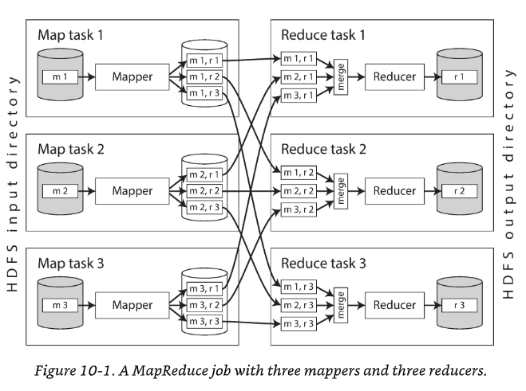

The chapter starts with a brief on online vs offline vs stream processing systems.

## Systems

### Services (online-systems)

1. Awaits a request.
2. Sends a response.

#### Metrics

- Response time is a measure of performance for such a system.
- (High) Availability is another important criteria for measuring a service.

### Batch Processing Systems (offline-systems)

1. Takes a large amount of data.
2. Runs a sequence of jobs to process.
3. Produces output.

Often scheduled to run periodically.

#### Metrics

- Throughput (time taken to produce output for a dataset of given size)

### Stream Processing Systems (near-real-time systems)

- Events are processed shortly after they occur.
- Usually stream processing systems have lower latency than batch-processing systems.

## Batch Processing with Unix Tools

We get a comparison between two approaches to the same problem. The objective is to log the most requested (top) 5 urls in the order of requests made.
The unix approach to the problem is a consice:

```bash
cat /var/log/nginx/access.log | awk '{print $7}' | sort | uniq -c | sort -r -n | head -n 5
```

We can get the same done via `python` like so:

```python
# Program reads nginx log files and prints n-most/least requested urls.
from typing import Dict, List
from collections import defaultdict


def read_logs(fpath: str) -> List[str]:
    with open(fpath, "r") as handle:
        return handle.read().splitlines()


def process_logs(logs: List[str]) -> defaultdict:
    url_requests = defaultdict(int)
    for log in logs:
        url = log.split()[6]
        url_requests[url] += 1
    return url_requests


def rank(url_requests: defaultdict, n=1, reverse=False) -> List[Dict[str, int]]:
    return [{url: url_requests[url]} for url in sorted(url_requests, reverse=reverse)]

rank(process_logs(read_logs("/var/log/nginx/access.log")), n=5, reverse=True)
```

The two might be functionally same, but we notice performance differences on larger log files.

- The in-memory `defaultdict` grows in size depending on the number of unique urls present in the log files.
- The unix example can sort the urls using disk-writes.
    - Data is partially sorted in-memory and moved to disks as segment files.
    - Multiple sorted segments can be merged into a larger sorted file.
    - Merge Sort has sequential access pattern, making it perform well on disks.
    - Can sort data even when larger than available memory by using disks.
    - Limited by the rate at which files can be read from disks.

## The Unix Philosophy

_Unix pipes built in 1964 by Doug McIlroy._

1. Make each program do one thing well. Don't complicate old programs by adding new features. Build afresh.
2. Expect the output of every program to become the input to another. 
    1. Do not clutter the output with extraneous information.
    2. Avoid stringently columnar or binary input formats.
3. Design and build software to be tried early. Ideally within weeks. Don't hesitate to throw away clumsy parts and rebuild.
4. Use tools in preference to unskilled help to lighten a programming task.

### Transparency and Experimentation

Notes on success for Unix tools:

1. Inputs are immutable. 
2. Outputs are saved in files. 
3. [2] allows debugging the intermediates in the pipeline.

The limitation of unix tools is single machine restriction. 

## MapReduce and Distributed File Systems

- `MapReduce` is built like Unix tools, but can be distributed across multiple machines.
- Fault tolerance: File blocks should be accessible in case of machine failures. 
    - This can be achieved by replication.
    - [Reed Solomon codes](https://en.wikipedia.org/wiki/Reed%E2%80%93Solomon_error_correction) to recover data without full replication.
    - [more](https://www.youtube.com/watch?v=dpxD8gwgbOc)

## Distributed execution of MapReduce



### Procedure

1. `MapReduce` frameworks copy the code to remote machines.
2. `Mappers` read the input files and produce key-value pairs.
3. `Reducers` computation runs in partitions.
    1. Authors decide how many reduce tasks to run.
    2. This is to ensure the same keys reach the same reducer.
4. The key-value pairs are supposed to be sorted (this can't be done on a single machine).
    1. Sorting is multi-stage.
    2. Each partition is written onto a sorted file.
