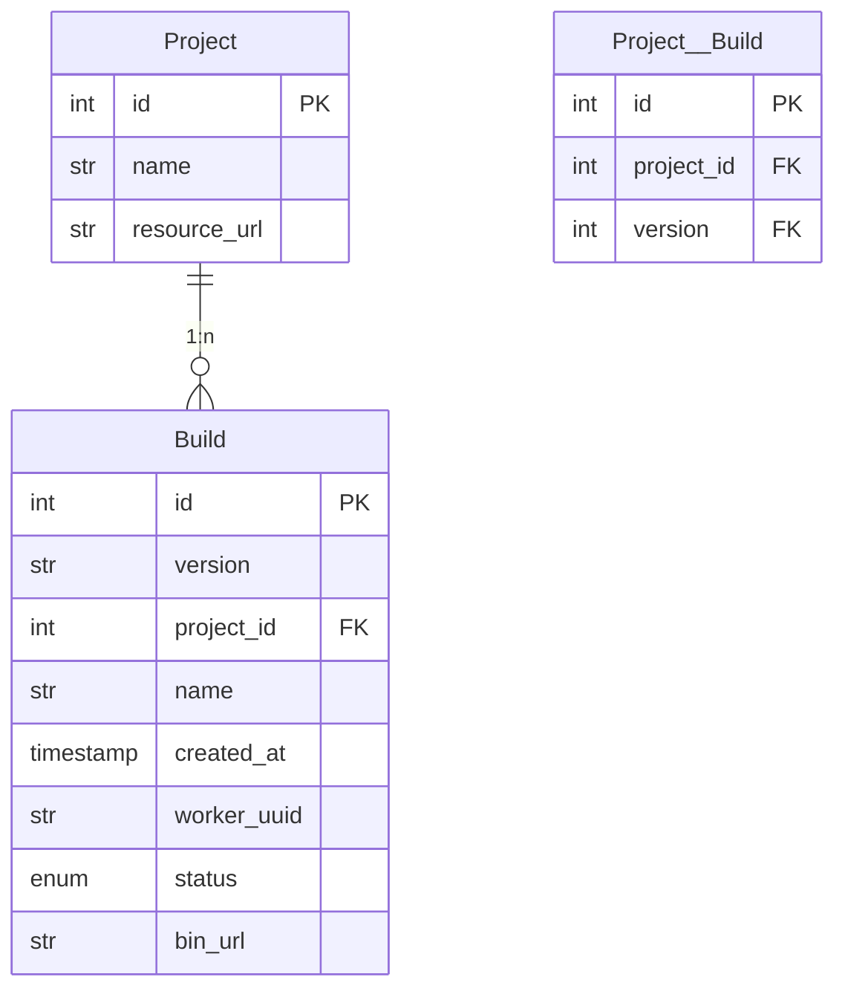

I heard about [mermaid](https://mermaid-js.github.io/mermaid/#/) a couple of months ago and I was curious about it. I used it for [dialogy](https://github.com/skit-ai/dialogy) a project I maintain at work. Mermaid has a very rich diagrams API that allows presentation right from markdown syntax. I went over the [sandbox](https://mermaid.live/edit), and tried out a few charts. I was impressed by the simplicity of the API, took me 15 minutes to figure out charts for flowcharts, class and state diagrams.

Say we wanted to whiteboard database schema for a code deployment system.

Here, a project can have various builds, implying a `1:n` relationship. We can store the relationship in a separate table `Project__Build` to have a history of
all the builds we have produced.

We can't yet is establish composite primary keys. A key can only be an `FK` (or foreign key) or a `PK` (or primary key), so if a key is both we can't do that.
In this situation, a build doesn't really need an auto-incrementing id. We can very well use the id and version of the project to identify a unique build.

I like that the project has a simple DSL over markdown for building beautiful diagrams. It helps me explain my [project components](https://skit-ai.github.io/dialogy/source/dialogy.workflow.html) to other team members. I use [sphinx](https://www.sphinx-doc.org/en/master/) with furo theme to build the docs. It was handy to have a [plugin for mermaid](https://github.com/mgaitan/sphinxcontrib-mermaid).

A small little gotcha while adding mermaid to my gatsby blog. I had to add `gatsby-remark-mermaid` to the `gatsby-config.js` file above the `gatsby-remark-prismjs` as stated
in the docs:

> This plugin processes markdown code blocks. If you have any other plugins which do that such as syntax highlighters, make sure you import this before those plugins.

This is mentioned in the [docs](https://www.gatsbyjs.com/plugins/gatsby-remark-mermaid/) but I missed it initially and spent some time trying to figure this out.
