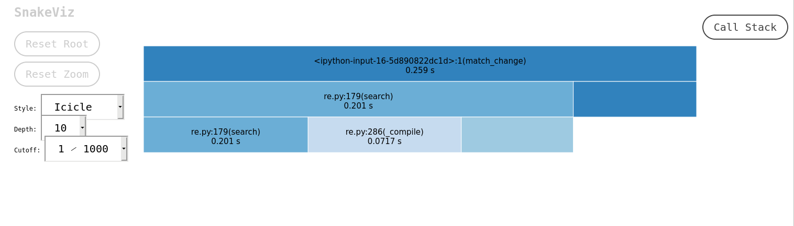
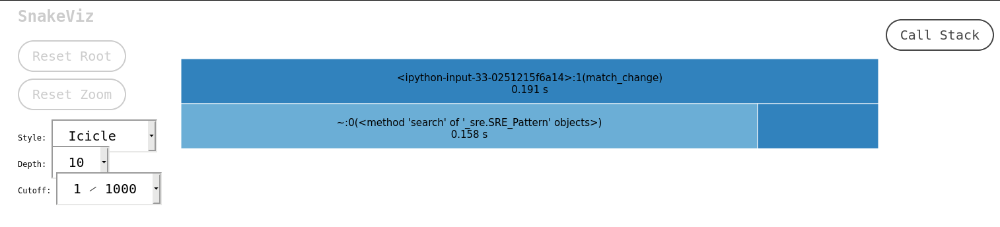
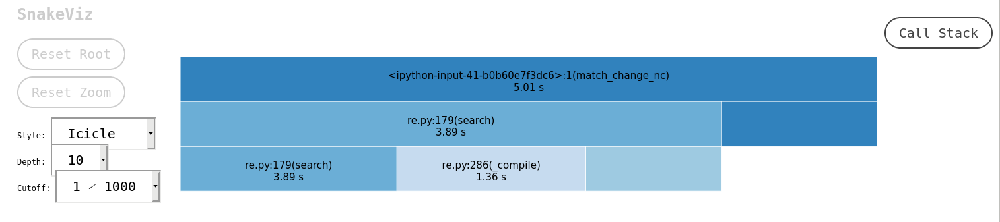
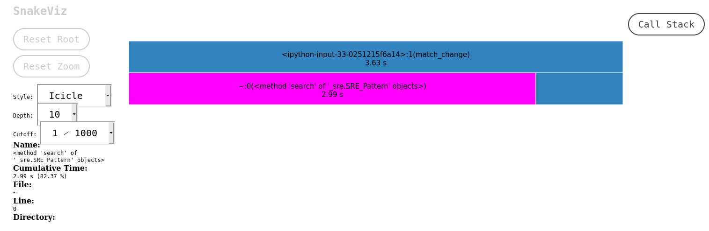
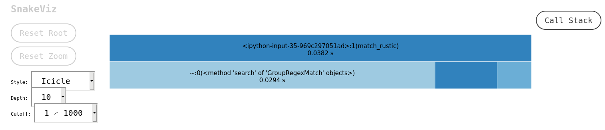

To start our study, we will use this [dataset](https://github.com/clinc/oos-eval/blob/master/data/data_full.json) from [this repository](https://github.com/clinc/oos-eval).
An introductory analysis shows:

```python
# CLINIC 150
In [1]: import json                                                                               


In [2]: with open("voice_commands/data_full.json", "r") as f: 
   ...:     data = json.load(f) 
   ...:                                                                                           

In [3]: len(data)                                                                                 
Out[3]: 6

In [4]: import pydash as py_                                                                      
In [5]: flat_items = py_.flatten(data.values())                                                   

In [6]: len(flat_items)                                                                           
Out[6]: 23700

In [7]: flat_items[0]                                                                             
Out[7]: ['set a warning for when my bank account starts running low', 'oos']

In [8]: data.keys()                                                                              
Out[8]: dict_keys(['oos_val', 'val', 'train', 'oos_test', 'test', 'oos_train'])

In [9]: data["oos_val"][0]                                                                       
Out[9]: ['set a warning for when my bank account starts running low', 'oos']

In [10]: data["val"][0]                                                                           
Out[10]: ['in spanish, meet me tomorrow is said how', 'translate']
```
Now, let's look at the training data a little bit to see what we have.

```python
# CLINIC150
In [16]: import random

In [17]: import copy

In [18]: training_data = copy.deepcopy(data["train"]) # To avoid mutating the reference.

In [22]: sentence, tags = zip(*training_data)

In [23]: labels = set(labels)

In [24]: len(set(labels)), len(training_data)  # Coincidence?
Out[24]: 150, 15000
```

This data-set seems to have a lot of diversity and the labels hint at conflicting vocabularies, this should be fun.
We have 7 types of change intents:

```python
# change intents
 'change_accent',
 'change_ai_name',
 'change_language',
 'change_speed',
 'change_user_name',
 'change_volume',
```
and 3 types of intents that have credit as keyword:

```python
# credit labels
 'credit_limit',
 'credit_limit_change',
 'credit_score',

```
These are just preliminary, eye-balled labels. There could be more than this but for our study we need either of them to have around 5-6k data points. Let's check that out.

Turns out the data-set is eerily balanced all labels have 100 data points each. So we'll work with the 900 that we get from `%change%` intents.
```python
{'change_accent',
 'change_ai_name',
 'change_language',
 'change_speed',
 'change_user_name',
 'change_volume',
 'credit_limit_change',
 'exchange_rate',
 'insurance_change',
 'oil_change_how',
 'oil_change_when',
 'pin_change',
 'tire_change'}
```
A random view of the sentences before we can proceed with the next few steps:

1. i wanna `change` your name to audrey
2. please respond to me in spanish
3. when do you think i should `change` my oil
4. can you swap to male voice
5. how long is an oil `change` good for
6. when does my oil need some changing
7. hey, speak slowly
8. i want you to speak to me faster
9. can you use a different accent
10. could you slow down your speech
11. what oil do i need and how is it `change`d
12. i want to use spanish as my language
13. could i please `change` your name to alicia
14. please `change` my name
15. i need for you to `change` your accent to the male british one
16. give me instructions on how to `change` my oil
17. i gotta `change` your name to remy
18. hey, stop talking like you're a stretch taped
19. can you find instructions on how to `change` oil in a car
20. i need to `change` your name to ben

11/20 sentences have the keyword, Seems like a good feature. Let's write a couple of regular expressions to see how well it goes.
```python
patterns = [
   r"change.*name",  
   r"change.*oil",  
   r"swap.*accent",  
   r"need.*change", 
   r"please.*change", 
   r"i need to.*change", 
   r"limit.*change", 
   r"change.*pin", 
   r"change.*tires?", 
   r"change.*credit limit", 
   r"language.*change", 
   r"change language", 
   r"pin.*change", 
   r"speed.*change", 
   r"change.*accent", 
   r"credit.*change", 
   r"insurance.*change", 
   r"oil.*change", 
   r"change.*speed", 
   r"how.*change", 
   r"when.*change", 
   r"why.*change"
]
```
We have 21 patterns just for change, let's scan our 15k strong dataset to see how bad are these features for picking `change_*` intents. 
Since we didn't target all patterns possible, it's okay to miss a lot out of 900, but it would be bad to match a lot with other intents.
Let's see how that goes.
```python
def match_change(items, patterns): 
    matches = [] 
    scores = [] 
    for item in items: 
        for pattern in patterns: 
            sentence = item[0] 
            match = re.search(pattern, sentence) 
            if match: 
                matches.append(item) 
                scores.append((match.end() - match.start())) 
    return matches, scores
```
We have an $O(n^{2})$ here, we could skip at the first match to get to $O(n\log{n})$, but we would like to use the span of the pattern to judge if we should go forward.
```python
# - Profiling code
In [17]: %time matches, scores = match_change(training_data, patterns)                            
CPU times: user 200 ms, sys: 0 ns, total: 200 ms
Wall time: 200 ms
```
That is very slow. **200ms** for just 21 patterns? we haven't even covered 100s of intents and this is just one pre-processing step. We will probably be building more features
like _pos-tags_, _tfidf vectors_ maybe we will use _word2vec_? or use the scores we just obtained to tune out the false positives and then the model inference. Production systems
must cater to patience range of human beings to qualify as good products.

Sure this also depends on the type of work. A batch-process that delivers results on e-mail after a while may be allowed to take that much time.
Here we are looking at the data of a smart-home device. Devices that should answer within **2-3 seconds**, already lose some time to accommodate for user speech (silence-detection),
usually getting nothing more than a second's leeway for replying back which has more things to compute than just the `intent`. It has to probably call an API, embed words into a 
response template and then convert that text to speech. All under **1s**. Can we afford to have a single step of pre-processing take **200ms**?

## Hammers and Pick-axes
Let's try to identify what is making things slow. We'll use `snakeviz` and `cProfile` for that.

```
pip install snakeviz
```
and inspect around the function to see what can we do about it.
```python
In [19]: import cProfile

In [20]: def monitor(f, *args): 
    ...:     pr = cProfile.Profile()
    ...:     pr.enable() 
    ...:     matches, scores = f(*args) 
    ...:     pr.disable() 
    ...:     pr.dump_stats("program.prof") 
    
In [21]: monitor(match_change, patterns)
```
The profiler saves the inspection results in `program.prof` this can be used by snakeviz to give helpful visualizations.
```
snakeviz /path/to/program.prof
```
I see this plot on my machine:


According to this we spend 201ms for `re.search` and 71ms for `re.compile`. Let's try to pre-compile our patterns and check the results.

```python
In [30]: compiled_patterns = [re.compile(pattern, flags=re.I) for pattern in patterns] 

In [31]: def match_change(items, patterns): 
    ...:     matches = [] 
    ...:     scores = [] 
    ...:     for item in items: 
    ...:         for pattern in compiled_patterns: # Swap the variable
    ...:             sentence = item[0] 
    ...:             match = pattern.search(sentence) # Change the API
    ...:             if match: 
    ...:                 matches.append(item) 
    ...:                 scores.append((match.end() - match.start())) 
    ...:     return matches, scores 

```
Line [30] has an additional `flags=re.I` thrown in, we would need it to do case insensitive searches. Let's see how much this change helps. It shouldn't do much because we only lost 70ms to it.


As expected this isn't a huge change, but let's not underestimate it as well. This is a change that scales. What if we had 100s of patterns? taking 4 patterns per-intent leads us to `4 x 150 = 600` Patterns.
Let's simulate with 400 patterns and compare the results, both with and without pre-compilation. Let's simulate some patterns:

```python
patterns = patterns * 20 # We have 440 patterns now.
```
We recalculate compiled_patterns as well to keep it fair.




A whopping **1.36s** saved! That said, both numbers are painfully sad to the point of being unusable or at least frustrating. This could mean around **7s to 10s** of total response from a smart-home device. That wouldn't be _very smart_.

## Slow patterns

We did talk about our code being a sloppy $O(n^{2})$ but there is more, a bigger culprit. If you use regular expressions a lot you probably noticed it a while back. Regular expression searches themselves are $O(n)$ to $O(n^{2})$ depending on the pattern and the engine. This might make them hard to fix, but there are hints. If your regular expression backtracks a lot, its going to hurt. Notice all the patterns we used had `.*` in them?

`.*` makes it convenient to express things like, _give me anything that has THIS and THAT, I don't care about what's in between_. This gives the regex engine a hard time, `.*` is greedy and that means it matches everything till it reaches _THAT_, but when it doesn't, it goes back a step to check if the things that it matched to `.*` happen to be _THAT_. The longer the sentences the slower this gets.

Let's try that out. The same patterns without `.*` but `\s` instead.
```python
In [55]: patterns = [r"change name",  
    ...: r"change oil",  
    ...: r"swap accent",  
    ...: r"need change", 
    ...: r"please change", 
    ...: r"i need to change", 
    ...: r"limit change", 
    ...: r"change pin", 
    ...: r"change tires?", 
    ...: r"change credit limit", 
    ...: r"language change", 
    ...: r"change language", 
    ...: r"pin change", 
    ...: r"speed change", 
    ...: r"change accent", 
    ...: r"credit change", 
    ...: r"insurance change", 
    ...: r"oil change", 
    ...: r"change speed", 
    ...: r"how change", 
    ...: r"when change", 
    ...: r"why change"]
```
Before we go ahead with these, let's see how our previous patterns fared in terms of results.
```python
{'insurance_change': 13,
 'change_language': 13,
 'change_user_name': 18,
 'oil_change_how': 175,
 'next_song': 1,
 'oil_change_when': 210,
 'reminder': 3,
 'change_speed': 8,
 'schedule_maintenance': 41,
 'todo_list': 2,
 'change_accent': 27,
 'tire_change': 88,
 'exchange_rate': 14,
 'pin_change': 75,
 'last_maintenance': 47,
 'measurement_conversion': 4,
 'taxes': 1,
 'cancel': 1,
 'reset_settings': 1,
 'credit_limit_change': 16,
 'change_ai_name': 50}
```
Don't worry about the numbers, we allowed the same sentence to match against different patterns so the count can cross the original class limits. It looks like these patterns while slow did a decent job, only a few matches are out of the expected classes, with minor frequency. We'll see how the modified pattern's fare in terms of speed and accuracy.

```python
{'insurance_change': 1,
 'change_language': 9,
 'change_user_name': 5,
 'oil_change_how': 20,
 'next_song': 1,
 'oil_change_when': 64,
 'reminder': 1,
 'change_speed': 2,
 'schedule_maintenance': 25,
 'todo_list': 2,
 'change_accent': 8,
 'tire_change': 8,
 'pin_change': 9,
 'last_maintenance': 18,
 'reset_settings': 1,
 'credit_limit_change': 6,
 'change_ai_name': 6}
```
These patterns are sparingly selective about the sentences. We will simulated a large number of patterns to compare with the previous. Let's see how slower is that, for the sake of bervity we will assume plots from compiled patterns.



That's not a lot of boost? A gain of 13ms is trivial when the overall time is over 3 seconds.

> TODO: Spend more time knowing why the gain is tiny.

## Compile time speed boost
There is still something we can do about programs that are slow. We can port our logic to a compiled language. Since python is dynamically typed it has to make assumptions about the data, this could be slow when performing compute intensive logic. This is where languages like C, C++, Go, Rust shine. I'll be picking Rust because of its unicode support and [pyo3](https://github.com/PyO3/pyo3) making it very easy to write wrappers around Rust code and presence of [maturin](https://github.com/PyO3/maturin) that allows shipping these wrappers as `pip` packages! Also the [regex](https://docs.rs/regex/1.3.7/regex/) Implementation has features missing in python, like [1](https://docs.rs/regex/1.3.7/regex/#example-avoid-compiling-the-same-regex-in-a-loop), [2](https://docs.rs/regex/1.3.7/regex/#example-match-multiple-regular-expressions-simultaneously) [3](https://docs.rs/regex/1.3.7/regex/#syntax) and [4](https://docs.rs/regex/1.3.7/regex/#crate-features).

```rust
// - Wrapper for python

extern crate regex;

use pyo3::prelude::*;
use std::os::raw::c_double;
use regex::Regex;


#[pyclass]
struct GroupRegexMatch {
  compiled_patterns: Vec<Regex>,
  intents: Vec<String>
}

#[pymethods]
impl GroupRegexMatch {
  #[new]
  fn new(patterns: Vec<&str>) -> PyResult<GroupRegexMatch> {
    let compiled_patterns: Vec<Regex> = patterns.into_iter()
        .map(|pattern| Regex::new(pattern).unwrap())
        .collect();
    Ok(GroupRegexMatch { compiled_patterns })
  }

  fn search(&self, texts: Vec<&str>) -> PyResult<Vec<f64>> {
    Ok(self.compiled_patterns.iter()
      .map(|pattern| {
        let scores: Vec<f64> = texts.iter()
          .map(|text| {
            match pattern.find(text) {
              None => 0.0,
              Some(mat) => ((mat.end() - mat.start())
                as c_double / text.len() as c_double)
            }
          }).collect();

        let non_zero_scores: Vec<f64> = scores.iter()
          .cloned()
          .filter(|score| score > &0.0)
          .collect();

        let max_score: f64 = non_zero_scores.iter()
          .cloned()
          .fold(-1./0., f64::max);

        let score = -1.0 * (non_zero_scores.len() as f64) * max_score;
        let e_to_score = score.exp();
        let score_sigmoid: f64 = if non_zero_scores.len() > 0 { 1. / (1. + e_to_score) } else { 0. };
        score_sigmoid
      }).collect())
  }
}


#[pymodule]
fn exegr(_py: Python, m: &PyModule) -> PyResult<()> {
  m.add_class::<GroupRegexMatch>()?;
  Ok(())
}
```
You can access the config from the original repository [here](https://github.com/ltbringer/exegr)

(A lot of code above won't be explained in this post as it is not the goal of this post to explain Rust programming or creating python bindings from Rust. 
The code is shared for the purposes of reproducing results.)

We have a Rust `struct` which is instantiated with patterns. It exposes a search method on the instance which accepts a list of sentences
and scores them with their span, vs length of the sentence. We need to build the binaries by running:

```shell
cargo build --release
```

This step produces `libexegr.so` because I named the package `exegr`, we can copy it as `exegr.so` into the directory we are running python code for testing and development. Once that is done,
we can use it like any ordinary python library.

```python
from exegr import GroupRegexMatch
```
We will also modify our function `match_regex` to use this new library.

```python
# - 
In [34]: g = GroupRegexMatch(patterns)

In [35]: def match_rustic(items): 
    ...:     matches = [] 
    ...:     scores = [] 
    ...:     for item in items: 
    ...:         score = sum(g.search([item[0]])) 
    ...:         if score > 0: 
    ...:             matches.append(item) 
    ...:             scores.append(score) 
    ...:     return matches, scores 
```
We pass each sentence one at a time and the library returns a list with scores for each pattern. If we see a non-zero score, we pick it (as we have been doing). We could pass multiple sentences but we aren't as we want them to be scored separately. This feature of accepting multiple sentences is for ASR outputs which generally produce multiple utterances that need to be used. Let's see how this works.



Yes, I ran this with all 440 patterns and we get down to **38ms**. This is much lesser than python's implementation using 21 patterns to yield results in **200ms**.

_fin._
